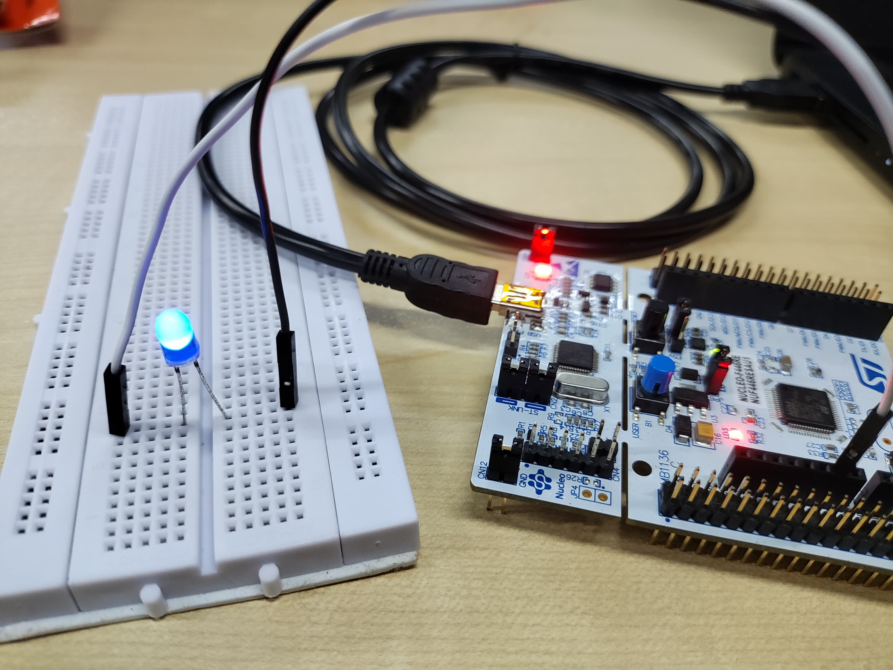
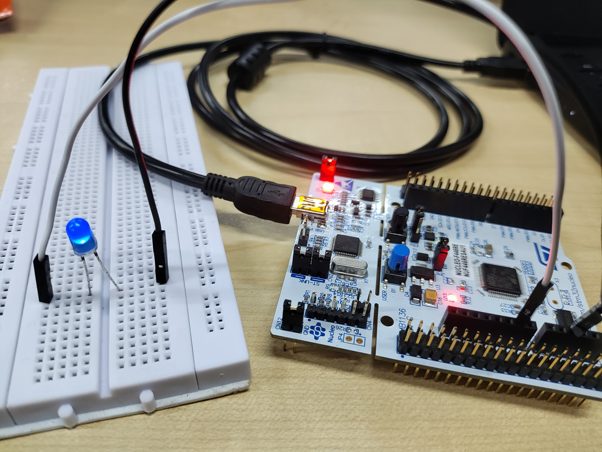
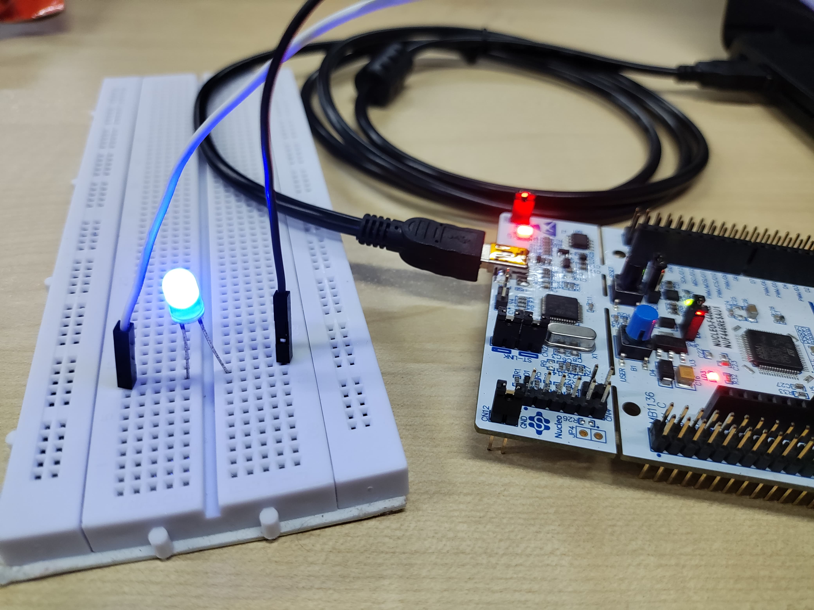

# STM32 Utility Application

This project demonstrates a basic utility application for the STM32F446xx microcontroller. The application provides a simple user interface via UART, allowing users to calculate the binomial coefficient (nCr) and increment a DAC value using a push button. The project includes initialization and configuration of various peripherals including the DAC, UART, and GPIO for the button and LED.

## Features

- **Binomial Coefficient Calculation**: Calculates the binomial coefficient (nCr) based on user inputs.
- **DAC Value Increment**: Increments the DAC value with a push button and updates an LED's intensity accordingly.
- **UART Communication**: Provides a text-based interface for user commands and feedback.

## Peripherals and Functions

### 1. DAC Initialization and Usage
- **DAC_Init()**: Configures the DAC and associated GPIO pins.
- **DAC_SetValue()**: Sets a specified value to the DAC.

### 2. UART Communication
- **UART_Init()**: Initializes the UART interface.
- **UART_Transmit()**: Sends a string via UART.
- **UART_Receive()**: Receives a string via UART.

### 3. Button and LED Control
- **Button_Init()**: Configures the user button and sets up the EXTI interrupt.
- **LED_Init()**: Initializes the LED GPIO pin.
- **LED_SetIntensity()**: Adjusts the LED intensity based on the DAC value.

### 4. Utility Functions
- **EXTI15_10_IRQHandler()**: Handles the EXTI interrupt for the user button, increments the DAC value, and updates the LED intensity.
- **Calculate_nCr()**: Computes the binomial coefficient for given values of n and r.

## Usage

1. **Initialize Peripherals**: On startup, the program initializes the SysTick, UART, DAC, button, and LED peripherals.
2. **User Commands**: The user is prompted with a list of commands via UART:
   - `1`: Calculate the binomial coefficient (nCr).
   - `2`: Increment the DAC value by pressing the button.
   - `3`: Exit the utility.
3. **Increment DAC Value**: When command `2` is selected, the user can increment the DAC value by pressing the button. The LED intensity will reflect the current DAC value.

## Project Files

- `main.c`: Contains the main program code and peripheral initialization functions.
- `pll.h`, `sysTick.h`: Headers for system clock configuration and SysTick timer.

## License

This software is licensed under the terms that can be found in the LICENSE file in the root directory of this software component. If no LICENSE file comes with this software, it is provided AS-IS.

